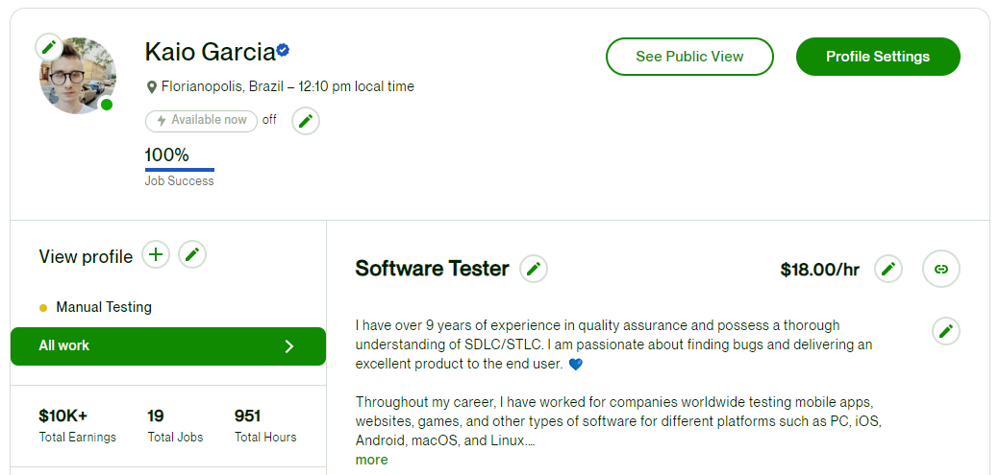

<h1 align="center">Oi, tudo bom? 💙</h1>

My name is Kaio, and I am trying to change how software testing is done. 🦄  

Quality assurance with more than 9 years of experience and complete knowledge of the entire software development life cycle, with a passion for finding bugs and delivering an excellent quality product to the end user. 💙

I also like to create my own games and 2D art, mainly pixel art and animation. Usually, I am busy playing a new instrument, having a beer, watching YouTube tutorials, or maybe trying to cook a random recipe that I saw online. 🍺 🍖

I was a <b>hardcore</b> gamer once, but now, I am trying my best to appreciate everything else life has to offer other than <b>"the internet"</b>. 🌈   

Contact me: kaioqa@protonmail.com 🙂  
LinkedIn: https://www.linkedin.com/in/kaioqa/ 🪐  
Upwork: <a href="https://www.upwork.com/freelancers/~012883d8474aaab92f">Hire me</a> 🤖

  

<h1 align="center">A little bit of my work as a QA 💻</h1>

I have 900+ hours of freelancing work using Upwork, you can check my profile below:

https://qakaio.github.io/upwork
  
</img>

<h1 align="center">Web automation scripts 💻 (Work In Progress) </h1>

I'm starting this repository to showcase some automation scripts that I've been working lately
Work in progress
https://github.com/qakaio/QA-Portfolio

